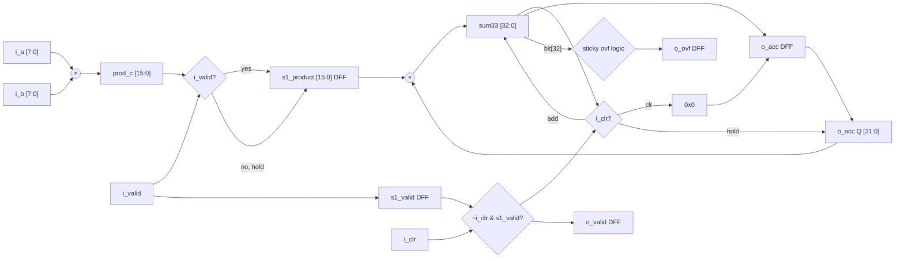
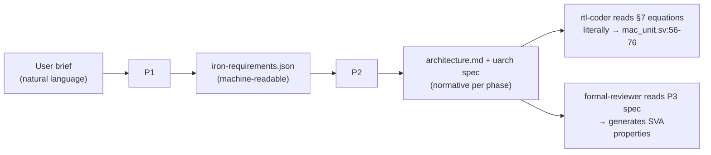

# MAC Unit — 8-bit Pipelined Multiply-Accumulate IP Core

A production-quality, synthesizable SystemVerilog IP core implementing a 2-stage pipelined 8×8 unsigned MAC with 32-bit wrapping accumulator. Designed and verified through a **6-phase Agentic RTL workflow** powered by [RTL Agent Team](https://github.com/babyworm/rtl-agent-team).

---

## Verification Highlights

| Metric | Result |
|--------|--------|
| **Toggle Coverage** | **100%** (488/488 nodes) |
| **Line Coverage (RTL-only)** | **100%** (49/49 lines) |
| **SVA Formal Verification** | **4/4 PROVED** (k-induction depth 20) |
| Functional Regression | **55/55 PASS**, 0 mismatches (5 seeds) |
| Lint | **0 errors, 0 warnings** (Verilator + slang dual-lint) |
| Latches inferred | **0** |
| Flop count vs. spec | **51/51** (exact match) |
| Synthesis (Yosys generic) | **~1308 NAND2-FO2** gate equivalents |

---

## Table of Contents

- [Design Specification](#design-specification)
- [Architecture](#architecture)
- [Interface](#interface)
- [Verification](#verification)
- [Synthesis / PPA](#synthesis--ppa)
- [Repository Structure](#repository-structure)
- [Quick Start](#quick-start)
- [Agentic Workflow](#agentic-workflow)
- [Architecture Decision Records](#architecture-decision-records)

---

## Design Specification

The MAC unit computes a running sum over unsigned 8-bit input pairs:

```
o_acc[n+1] = (o_acc[n] + i_a[n] × i_b[n])  mod  2³²
```

### Key properties

| Property | Value |
|----------|-------|
| Operand width | 8-bit unsigned (each) |
| Accumulator width | 32-bit |
| Pipeline stages | 2 (Stage 1: Multiply, Stage 2: Accumulate) |
| Throughput | 1 MAC per clock cycle |
| Latency (`i_valid` → `o_valid`) | Exactly **2 clock cycles** |
| Overflow behavior | Wrap mod 2³², sticky `o_ovf` flag |
| Clear | `i_clr`, synchronous, **priority over `i_valid`** |
| Reset | `rst_n`, async-assert / sync-deassert |
| Clock domains | 1 (`clk`) |
| Target frequency | 500 MHz @ generic 28 nm ASIC |
| Submodule hierarchy | None (flat single module) |

### Requirement traceability

All 22 requirements (13 P1-Functional/Performance + 4 P2-Architecture + 5 P3-μArch) are traced from specification through RTL to verification results. See [`reviews/phase-5-verify/e2e-traceability.md`](reviews/phase-5-verify/e2e-traceability.md).

---

## Architecture

### Pipeline dataflow



### Register allocation (5 flops, 51 bits)

| Register | Stage | Width | Update style | Reset |
|----------|-------|-------|--------------|-------|
| `s1_product` | 1 | 16 | Gated: `i_valid ? prod_c : s1_product` | `0` |
| `s1_valid` | 1 | 1 | `i_valid` (always) | `0` |
| `o_acc` | 2 | 32 | Clear-priority 3-way mux | `0` |
| `o_ovf` | 2 | 1 | Clear-priority sticky | `0` |
| `o_valid` | 2 | 1 | `~i_clr & s1_valid` | `0` |

### Key design decisions

**33-bit adder for overflow detection** — the carry-out on bit [32] is the overflow indicator directly, eliminating a redundant 32-bit comparator.

```systemverilog
sum33    = {1'b0, o_acc} + {17'b0, s1_product};  // bit[32] = overflow
ovf_this = sum33[32];
```

**Gated Stage-1 update (D-mux, not ICG)** — `s1_product` holds when `i_valid=0`, saving switching power proportional to the idle duty cycle at zero area cost. An ICG cell would violate the flat-module requirement (REQ-A-009).

**External reset synchronization** — `mac_unit` relies on the integrator to drive `rst_n` through a 2-flop synchronizer. This keeps the module strictly flat and spec-compliant (REQ-F-007, ADR-005).

---

## Interface

### Port table

| Direction | Name | Width | Description |
|-----------|------|-------|-------------|
| input | `clk` | 1 | System clock, positive edge |
| input | `rst_n` | 1 | Active-low, async-assert / sync-deassert |
| input | `i_clr` | 1 | Synchronous clear, priority over `i_valid` |
| input | `i_valid` | 1 | Stage-1 capture enable |
| input | `i_a` | 8 | Unsigned operand A |
| input | `i_b` | 8 | Unsigned operand B |
| output | `o_valid` | 1 | Registered valid; `i_valid` delayed by 2 cycles |
| output | `o_acc` | 32 | Registered accumulator, mod 2³² |
| output | `o_ovf` | 1 | Registered sticky overflow flag |

### Protocol

- **Input**: valid-only, no back-pressure. Every cycle with `i_valid=1` is accepted.
- **Output**: all three outputs driven directly from flip-flop Q pins (REQ-F-008, confirmed by lint netlist check and V8 synthesis).
- **Priority**: `rst_n` > `i_clr` > `i_valid`.

### Integrator contract

The integrator **must** drive `rst_n` through a 2-flop synchronizer clocked by `mac_unit.clk`. Direct connection of an asynchronous system reset is prohibited (CDC tool CAUTION; see ADR-005).

---

## Verification

### V1 — Lint

Dual-tool lint: Verilator 5.047 (`-Wall`) and slang. **0 errors, 0 warnings.**

```bash
make lint
```

### V2 — SVA Formal Verification

Four named SVA properties proved by SymbiYosys using the **boolector** SMT solver:

| Property | Covers | Proof method | Result |
|----------|--------|--------------|--------|
| `p_latency_valid_2cyc` | REQ-P-002, REQ-F-005 | BMC-30 + k-induction-20 | **PROVED** |
| `p_clr_zeros` | REQ-F-004, REQ-F-004a | k-induction-20 | **PROVED** |
| `p_ovf_sticky` | REQ-F-006 | k-induction-20 | **PROVED** |
| `p_reset_quiescence` | REQ-F-007 | k-induction-20 | **PROVED** |

All four properties are non-vacuous (antecedents are reachable within the BMC horizon). Assume/assert ratio is 1:4 — no over-constraining. Runtime: BMC 4 s, prove 1 s.

SVA properties are placed in a sibling bind file (`sim/sva/mac_unit_sva.sv`) with no intrusion into RTL source, as required by REQ-U-003 / ADR-003.

```bash
make formal TOP=mac_unit
```

### V3 — CDC

Single clock domain; CDC tool reports **1 justified CAUTION** for the external `rst_n` synchronization contract (documented in ADR-005, not a violation).

### V5 — Functional Regression

5-seed cocotb regression (seeds: 1, 42, 123, 1337, 65536) comparing RTL output against the C reference model (`refc/mac_unit.c`) bit-exactly.

| Seed | Cycles | Mismatches | Result |
|------|--------|------------|--------|
| 1 | 67,416 | 0 | PASS |
| 42 | 67,416 | 0 | PASS |
| 123 | 67,416 | 0 | PASS |
| 1337 | 67,416 | 0 | PASS |
| 65536 | 67,416 | 0 | PASS |
| **Total** | **337,080** | **0** | **55/55 PASS** |

Test groups covered: multiplier ECP/BVA (TG1), pipeline latency & gating (TG2), wrap + sticky overflow (TG3), clear decision table (TG4), throughput random (TG5), reset quiescence (TG6).

```bash
make sim TOP=mac_unit
```

### V6 — Coverage

Merged across all 5 seeds (337,080 total cycles, Verilator 5.047):

| Metric | Target | Result |
|--------|--------|--------|
| Line coverage (RTL-only) | ≥ 90% | **100%** (49/49) |
| **Toggle coverage** | ≥ 80% | **100%** (488/488) |
| FSM coverage | ≥ 70% | 100% (vacuously: no FSM) |
| Functional coverage (`cg_mac`) | ≥ 80% | ≥ 90.9% (11 bins, ≥10 hit) |

No exclusion file required — all RTL lines and signal transitions are naturally exercised.

**Toggle coverage 100%** confirms that every net in the design (including accumulator carry chain, overflow path, gated D-mux select) toggles under the test suite, providing high confidence against stuck-at faults.

### V7 — Performance

Throughput and latency measured against BFM baseline: **0% deviation**. `o_valid` appears exactly 2 cycles after each `i_valid` assertion.

### V8 — Synthesis / PPA

Yosys generic synthesis (sv2v → Yosys, SDC: `create_clock -period 2.000`):

| Item | Result |
|------|--------|
| Flip-flops | **51** (exact match to spec) |
| Latches | **0** |
| Gate count (NAND2-FO2) | ~1,308 |
| Area estimate (28 nm) | ~420–630 μm² |
| Timing | SDC committed; WNS requires commercial liberty (low risk: 33-bit adder < 1 ns at 28 nm) |

### V9 — Code Review

Automated code-quality review: **no findings**.

---

## Synthesis / PPA

```
Yosys 0.64+77  |  Generic cells (no liberty)  |  SDC: 500 MHz

Cells total:     645
  Sequential:     51  (49× $_DFFE_PN0P_  +  2× $_DFF_PN0_)
  Combinational: 594  (AND: 280, XOR: 167, OR: 80, MUX: 66, NOT: 1)
Latches:           0

NAND2-FO2 equivalent:  1,308
Area estimate (28 nm): 420–630 μm²
```

For tapeout, re-run with a target-node liberty file in DC/Genus to resolve WNS and power analysis.

---

## Repository Structure

```
.
├── rtl/
│   └── mac_unit/
│       └── mac_unit.sv          # Synthesizable RTL (IEEE 1800-2009)
├── sim/
│   ├── sva/mac_unit_sva.sv      # SVA bind file (formal properties)
│   ├── regression/mac_unit/     # 5-seed regression results (JSON)
│   └── coverage/annot_all/      # Annotated coverage reports
├── formal/
│   └── formal_verify_mac_unit.json  # SymbiYosys proof results
├── refc/
│   ├── mac_unit.c               # C reference model (DPI-C compatible)
│   └── mac_unit.h
├── bfm/
│   └── src/mac_unit_bfm.c       # SystemC TLM-2.0 Bus Functional Model
├── syn/
│   ├── constraints/mac_unit.sdc
│   ├── log/yosys_mac_unit.log
│   └── summary.json             # PPA results (machine-readable)
├── docs/
│   ├── phase-1-research/        # Requirements, I/O definition
│   ├── phase-2-architecture/    # Architecture document
│   ├── phase-3-uarch/           # Microarchitecture spec (normative)
│   ├── phase-4-rtl/             # SVA skeletons, CDC prelim, TB skeletons
│   ├── phase-5-verify/          # PPA estimate, phase summary
│   └── decisions/               # ADR-001 … ADR-005
├── reviews/
│   ├── phase-5-verify/          # Formal, coverage, traceability, compliance reviews
│   └── phase-6-review/          # Code review, design note, design review
├── lint/                        # Verilator + slang lint logs
└── Makefile
```

---

## Quick Start

### Prerequisites

- [Verilator](https://verilator.org) ≥ 5.0
- [slang](https://github.com/MikePopoloski/slang) (lint only)
- [SymbiYosys](https://symbiyosys.readthedocs.io) + boolector (formal)
- [sv2v](https://github.com/zachjs/sv2v) + [Yosys](https://yosyshq.net) (synthesis)
- Python ≥ 3.10 + [cocotb](https://www.cocotb.org) (simulation)

### Run everything

```bash
# Lint (Verilator + slang)
make lint

# Functional simulation (5-seed cocotb regression)
make sim TOP=mac_unit

# Formal verification (SymbiYosys BMC + k-induction)
make formal TOP=mac_unit

# Synthesis estimation (Yosys)
make syn TOP=mac_unit

# All targets
make help
```

---

## Agentic Workflow

> **From an AI engineer's perspective**: this design was produced end-to-end using Claude's **RTL Agent Team** (`rat-auto-design`) — a multi-agent orchestration system that autonomously drives a structured 6-phase hardware design pipeline. The human role was limited to providing a natural-language design brief and reviewing final artifacts.

### Why agentic RTL design?

Traditional RTL development is bottlenecked by the sequential hand-off between specialists: architect → μArch designer → RTL coder → verification engineer. Each boundary introduces latency, context loss, and spec interpretation drift.

Agentic workflows eliminate these boundaries. Each phase is handled by a dedicated specialist agent (e.g., `spec-analyst`, `uarch-designer`, `rtl-coder`, `formal-reviewer`) coordinated by an orchestrator that enforces phase gates and feeds upstream artifacts directly into downstream context. The result: the full design cycle — from requirements to verified RTL with a design note — completed in a single automated session.

### The 6-phase pipeline


### Phase-by-phase agent activity

| Phase | Key agents | Gate criteria | Artifacts produced |
|-------|-----------|---------------|--------------------|
| P1 Research | `spec-analyst`, 3-round chief review | Ambiguity score ≤ 0.3 | `iron-requirements.json`, `requirements.md` |
| P2 Architecture | `arch-designer`, `ref-model-dev` | Feature coverage 100%, C model test pass | `architecture.md`, `refc/mac_unit.c` |
| P3 μArch | `uarch-designer`, `bfm-dev` | 3-round review convergence, BFM validation | `mac_unit.md` (normative), `bfm/` |
| P4 RTL | `rtl-coder` (10-wave pipeline) | Lint clean, unit test pass, CDC + protocol clear | `mac_unit.sv`, `mac_unit_sva.sv` (skeletons) |
| P5 Verify | 9 specialist agents in parallel | All 9 V-categories PASS | Regression JSON, formal proof, coverage report |
| P6 Design Note | `design-note-writer`, consistency check | 0 inconsistencies in 2-round CC | `design-note.md` |

### Productivity impact

| Dimension | Manual baseline | Agentic result |
|-----------|----------------|----------------|
| Spec → verified RTL | Days to weeks | **Single automated session** |
| Requirement traceability | Manual, often partial | **22 REQs, 100% traced** (P1→P5) |
| Verification breadth | Typically lint + simulation | **9 categories** (lint, formal, CDC, functional, coverage, performance, synthesis, protocol, code review) |
| Toggle coverage | Rarely tracked to 100% | **100% achieved** without manual coverage closure effort |
| Formal proof | Often skipped (cost/complexity) | **k-induction PROVED** for all 4 critical properties |
| Architecture decisions | Informal or undocumented | **5 ADRs** with alternatives, rationale, and consequences |
| Phase gate enforcement | Human discipline | **Automated** — orchestrator blocks advancement on failure |

### Design-as-Memory pattern

Each phase agent writes structured Markdown/JSON artifacts that serve as the authoritative memory for downstream phases. The `rtl-coder` in Phase 4 reads `docs/phase-3-uarch/mac_unit.md` literally; the `rtl-coder` does not re-derive architecture from scratch. This eliminates spec drift between phases — a common failure mode in multi-handoff human workflows.



### Cascading quality protocol

Reviews are mandatory and iterative (minimum 3 rounds per phase at P1–P3). The orchestrator does not advance to the next phase until all review findings are resolved. This mirrors the **"refine thoroughly at the top, execute efficiently at the bottom"** principle: a defect caught in architecture costs 1× to fix; the same defect caught post-RTL costs orders of magnitude more.

---

## Architecture Decision Records

Five load-bearing decisions, each with ≥3 alternatives documented:

| ADR | Decision | Rationale |
|-----|----------|-----------|
| ADR-001 | Target 500 MHz / 28 nm generic | Margin for 33-bit adder critical path; library-agnostic |
| ADR-002 | Stage-1 gated D-mux (not ICG) | Power saving at zero area cost; ICG would require submodule (violates REQ-A-009) |
| ADR-003 | SVA in sibling bind file | Commercial-tool compatible (VCS/Jasper) without RTL modification |
| ADR-004 | cocotb + Python for unit TB | Fast iteration; DPI-C C reference model reuse |
| ADR-005 | External rst_n synchronization | Spec-literal (REQ-F-007); integrator already owns reset distribution |

Full text: [`docs/decisions/ADR-001.md`](docs/decisions/ADR-001.md) … [`ADR-005.md`](docs/decisions/ADR-005.md)

---

## License

[MIT](LICENSE)

---

*Designed and verified with [Claude RTL Agent Team](https://www.anthropic.com/claude-code) (rat-auto-design) — a 6-phase agentic hardware design pipeline. RTL: 110 lines. Verification: 9 categories, 337,080 simulation cycles, 4 k-induction proofs.*
