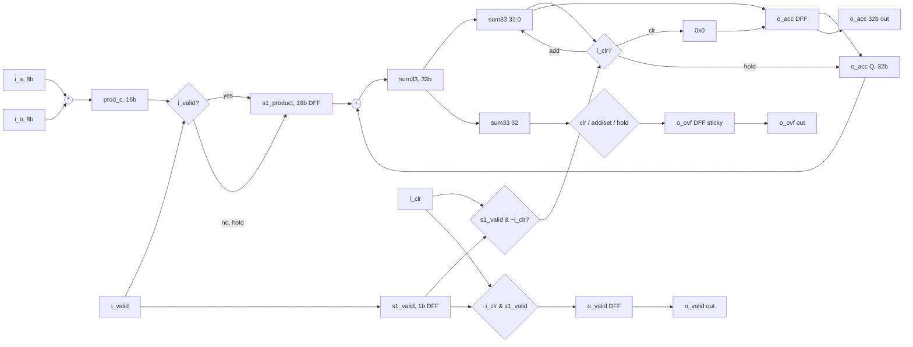
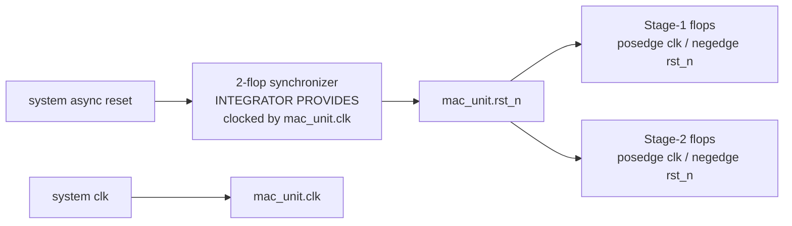

# Design Note: `mac_unit` (Phase 6)

- Date: 2026-04-24
- Author: design-note-writer (Phase 6, Wave 2)
- Scope: Single-module design, `rtl/mac_unit/mac_unit.sv` (110 lines)
- Upstream references:
  - P1 spec: `docs/phase-1-research/iron-requirements.json`
  - P2 arch: `docs/phase-2-architecture/architecture.md`, `iron-requirements.json`
  - P3 uArch: `docs/phase-3-uarch/mac_unit.md` (NORMATIVE), `iron-requirements.json`
  - ADRs: `docs/decisions/ADR-001..005.md`
  - Verification: `docs/phase-5-verify/phase-5-summary.md`, `reviews/phase-5-verify/final-compliance.md`
- Review context: `reviews/phase-6-review/code-review.md`, `reviews/phase-6-review/design-review.md`

---

## 1. Module Overview & Purpose

### 1.1 What does `mac_unit` do?

`mac_unit` is an 8x8 unsigned Multiply-Accumulate (MAC) datapath with a
32-bit wrapping accumulator, a sticky overflow flag, and a synchronous clear
that has priority over incoming data. It accepts one operand pair per cycle
and emits a running sum `o_acc = (o_acc_prev + i_a * i_b) mod 2^32` two
cycles later.

### 1.2 Where does it sit in the hierarchy?

This is a **flat, single-module IP core** (REQ-A-009). It is its own top
level — there is no parent wrapper, and it contains no sub-modules. A
typical integrator instantiates `mac_unit` behind an externally synchronized
reset distribution network (per ADR-005 / REQ-U-005) and a simple valid-only
stimulus source.

### 1.3 At-a-glance data sheet

| Property                     | Value                                           |
|------------------------------|-------------------------------------------------|
| Operand width                | 8 bits unsigned (each)                          |
| Accumulator width            | 32 bits                                         |
| Pipeline depth               | 2 stages                                        |
| Throughput                   | 1 MAC per clock                                 |
| Latency                      | Exactly 2 clocks (i_valid@T -> o_valid@T+2)     |
| Clock domains                | 1 (`clk`)                                       |
| Reset                        | `rst_n`, async-assert, sync-deassert (external) |
| Overflow behavior            | Wrap mod 2^32, sticky `o_ovf` flag              |
| Clear                        | `i_clr`, synchronous, priority over `i_valid`   |
| Flop count                   | 5 named flops / 51 total bits                   |
| Latches                      | 0                                               |
| Target frequency             | 500 MHz (committed; REQ-U-001, ADR-001)         |
| Target library               | Generic 28 nm                                   |
| Synth cell estimate          | ~1308 NAND2-FO2 (yosys generic Tier-2)          |
| Submodules                   | 0 (REQ-A-009)                                   |

---

## 2. Decision Rationale (WHY this design?)

### 2.1 Why 2 stages?

A 1-stage version is viable at low frequency but puts an 8x8 multiplier plus
a 32-bit adder on the same critical path. At 500 MHz in a generic 28 nm
process, that leaves insufficient margin for routing and clock uncertainty
(confirmed by ADR-001 context). A 3+ stage version could hit >500 MHz but
would violate REQ-P-002 (exactly 2-cycle latency).

**Chosen: 2 stages — Stage 1 captures the multiplier output, Stage 2 performs
the accumulate and overflow detection.** Meets both REQ-P-001 (1 MAC/cycle)
and REQ-P-002 (2-cycle latency) with comfortable slack.

### 2.2 Why unsigned `*` (not Booth / Wallace / DSP primitive)?

REQ-A-001 mandates the SystemVerilog `*` operator. Rationale: at 8x8,
commercial synthesis will pick the node-optimal tree (typically a small
Wallace for ASIC, a DSP48 for FPGA). Hand-coding adds verification burden
with zero PPA upside at this size (see ADR-001 §Options).

### 2.3 Why a 33-bit adder for a 32-bit accumulator?

The natural carry-out on bit [32] **IS** the overflow indicator. The
alternative — a separate 32-bit compare between (acc+prod) and the operand
domain — costs more gates and duplicates logic that the adder already has.
See `rtl/mac_unit/mac_unit.sv:58`:
```systemverilog
sum33 = {1'b0, o_acc} + {17'b0, s1_product};
// bit[32] = overflow; bits[31:0] = wrapped result
```

### 2.4 Why gated Stage-1 update (not always-update, not ICG)?

Options considered (ADR-002):
- Always-update: simplest synthesis; flops toggle on every cycle.
- **Gated (chosen)**: `s1_product <= i_valid ? prod_c : s1_product;` —
  flops hold on invalid cycles, saving dynamic power proportional to
  (1 - i_valid duty cycle). Synthesizes to a flop with a 2:1 mux on the
  D pin — **zero area cost** vs. always-update.
- ICG cell: best power, but requires instantiating `common/icg.sv`, which
  violates REQ-A-009 (no submodule hierarchy).

### 2.5 Why no internal reset synchronizer?

ADR-005 decision: the integrator is responsible for 2-flop synchronizing
`rst_n` deassertion before it reaches `mac_unit`. Rationale:
- REQ-F-007 acceptance criteria states this literally ("synchronized externally").
- Adding an internal synchronizer would violate REQ-A-009 (no submodule
  hierarchy) because project policy requires the synchronizer to come from
  `rtl/common/`.
- The integrator already owns system-level reset distribution and can share
  a single synchronizer across many IPs.

### 2.6 Why no back-pressure (`o_ready`)?

REQ-A-007 / REQ-F-009 freeze the port list without a ready channel.
`mac_unit` sustains 1 beat/cycle unconditionally (REQ-P-001), so
back-pressure has no functional role. Adding it would:
- Expand the port contract (REQ-F-009 freeze violation).
- Create a downstream-side stall path with no upstream logic that could
  ever assert it.

### 2.7 Why sticky overflow (not one-shot)?

REQ-F-006 specifies sticky semantics: "once set, o_ovf remains 1 even if
subsequent adds do not overflow". Rationale: a one-shot flag would race
with consumer sampling at lower clock rates. Sticky semantics mean the
consumer can poll at any frequency and learn that overflow occurred.

---

## 3. Module Connections (HOW data flows)

### 3.1 Top-level architecture

```d2
direction: right

clk: {shape: circle}
rst_n: {shape: circle}
i_a: {shape: circle; label: "i_a[7:0]"}
i_b: {shape: circle; label: "i_b[7:0]"}
i_valid: {shape: circle}
i_clr: {shape: circle}
o_valid: {shape: circle}
o_acc: {shape: circle; label: "o_acc[31:0]"}
o_ovf: {shape: circle}

mac_unit: {
  label: "mac_unit (flat, single module)"
  style.fill: "#f0f4ff"

  stage1: {
    label: "Stage 1 (1 clk)"
    mul: {label: "8x8 unsigned *\n(synth-inferred)"}
    s1_product_reg: {label: "s1_product[15:0]\nDFF, gated"; shape: rectangle}
    s1_valid_reg: {label: "s1_valid\nDFF"; shape: rectangle}
    mul -> s1_product_reg: "prod_c[15:0]"
  }

  stage2: {
    label: "Stage 2 (1 clk)"
    adder: {label: "33-bit add\n{1'b0,acc}+{17'b0,prod}"}
    ctrl: {label: "clr-priority mux\nvalid-gating\nsticky ovf"}
    acc_reg: {label: "o_acc[31:0]\nDFF"; shape: rectangle}
    ovf_reg: {label: "o_ovf\nDFF"; shape: rectangle}
    valid_reg: {label: "o_valid\nDFF"; shape: rectangle}
    adder -> ctrl: "sum33[32:0]"
    ctrl -> acc_reg: "acc_nxt[31:0]"
    ctrl -> ovf_reg: "ovf_nxt"
    ctrl -> valid_reg: "ovld_nxt"
  }

  stage1 -> stage2: "s1_product,\ns1_valid"
}

i_a -> mac_unit.stage1.mul
i_b -> mac_unit.stage1.mul
i_valid -> mac_unit.stage1.s1_valid_reg: "gate"
i_clr -> mac_unit.stage2.ctrl: "priority"
clk -> mac_unit
rst_n -> mac_unit: "async-assert,\nsync-deassert\n(external sync)"

mac_unit.stage2.acc_reg -> o_acc
mac_unit.stage2.ovf_reg -> o_ovf
mac_unit.stage2.valid_reg -> o_valid
```

### 3.2 Pipeline dataflow (Mermaid)



### 3.3 Pipeline stage diagram (Mermaid sequenceDiagram)

Representative trace: `i_valid` asserted at T, T+1, T+3, T+4; `i_clr` asserted at T+2.

```mermaid
sequenceDiagram
    participant IN as Input pads
    participant S1 as Stage 1<br/>(s1_product, s1_valid)
    participant S2 as Stage 2<br/>(o_acc, o_ovf, o_valid)

    Note over IN,S2: T-1: quiescent (acc=0, ovf=0, valid=0)
    IN->>S1: T: i_valid=1, a=A0, b=B0
    Note over S1: T+1: s1_product=A0*B0, s1_valid=1
    IN->>S1: T+1: i_valid=1, a=A1, b=B1
    S1->>S2: T+2: add A0*B0 into o_acc
    Note over S2: T+2: o_acc=A0*B0, o_valid=1 (if !clr)
    IN->>S2: T+2: i_clr=1 (OVERRIDES)
    Note over S2: T+2: o_acc<=0, o_ovf<=0, o_valid<=0<br/>(A0*B0 discarded at output)
    Note over S1: T+2: s1_product=A1*B1 (Stage 1 untouched by clr)
    IN->>S1: T+3: i_valid=1, a=A3, b=B3
    Note over S1,S2: T+3: Stage 2 sees s1_valid from T+2, but clr=0 now
    Note over S2: T+3: o_acc=A1*B1, o_valid=1
    IN->>S1: T+4: i_valid=1, a=A4, b=B4
    Note over S1,S2: T+4: accumulate A3*B3; o_acc=A1*B1+A3*B3
    Note over S2: If cum sum >= 2^32: o_ovf latches 1 (sticky)
```

### 3.4 Reset distribution (Mermaid)



---

## 4. Detailed Combinational Equations (uArch §7 — normative)

The RTL at `rtl/mac_unit/mac_unit.sv:56-76` implements these equations literally:

```
prod_c       = i_a * i_b;                                // 16-bit unsigned
sum33        = {1'b0, o_acc} + {17'b0, s1_product};      // 33-bit
ovf_this     = sum33[32];                                // carry-out
acc_add_en   = s1_valid & ~i_clr;                        // gate + clr priority

acc_nxt      = i_clr       ? 32'h0000_0000
             : acc_add_en  ? sum33[31:0]
             :               o_acc;

ovf_nxt      = i_clr                   ? 1'b0
             : (acc_add_en & ovf_this) ? 1'b1
             :                           o_ovf;

ovld_nxt     = ~i_clr & s1_valid;
```

Key invariants:
- `i_clr` dominates every mux (priority).
- Overflow can only set when the add actually occurs (`acc_add_en` gate).
- `ovld_nxt` uses `~i_clr & s1_valid` — matches the RTL line-by-line.

---

## 5. Register Allocation Table (5 flops / 51 bits)

| Register     | Stage   | Width | Update style                                 | Reset value     |
|--------------|---------|-------|----------------------------------------------|-----------------|
| `s1_product` | Stage 1 | 16    | `i_valid ? prod_c : s1_product` (gated)      | `16'h0000`      |
| `s1_valid`   | Stage 1 |  1    | `i_valid` (always update)                    | `1'b0`          |
| `o_acc`      | Stage 2 | 32    | `acc_nxt` (clr-priority 3-way mux)           | `32'h0000_0000` |
| `o_ovf`      | Stage 2 |  1    | `ovf_nxt` (clr-priority sticky)              | `1'b0`          |
| `o_valid`    | Stage 2 |  1    | `ovld_nxt = ~i_clr & s1_valid`               | `1'b0`          |
| **Total**    | —       | **51**| —                                            | all zero        |

Storage type: **all flip-flops** (sub-256-bit threshold per project storage
selection criteria). No SRAM wrapper required. V8 yosys synthesis confirms
51 flops / 0 latches exactly.

---

## 6. Timing / Clock / Reset Architecture

| Aspect                        | Specification                                    |
|-------------------------------|--------------------------------------------------|
| Clock port                    | `clk` (single domain)                            |
| Clock period (SDC)            | `create_clock -period 2.000 [get_ports clk]`     |
| Active edge                   | posedge                                          |
| Reset port                    | `rst_n` (active-low)                             |
| Reset assertion               | Asynchronous (directly triggers flop CLR pin)    |
| Reset deassertion             | **Synchronous** (externally synchronized, ADR-005) |
| Reset values                  | All 5 flops reset to zero (REQ-F-007)            |
| Generated clocks              | None                                             |
| Clock gating                  | None at P3 (REQ-U-002 uses D-pin enable mux)     |
| Synchronizers in mac_unit     | 0 (external rst_n sync contract)                 |
| Critical path                 | Stage-2 33-bit adder (comfortably sub-1 ns in 28 nm) |

**Template** (identical in both `always_ff` blocks):
```systemverilog
always_ff @(posedge clk or negedge rst_n) begin
    if (!rst_n) begin
        // flop reset values
    end else begin
        // flop updates
    end
end
```

---

## 7. Interface Description (9 ports, valid-only protocol)

### 7.1 Port table (verified against RTL)

| Direction | Name      | Width | RTL line | Description                                             |
|-----------|-----------|-------|----------|---------------------------------------------------------|
| input     | `clk`     | 1     | 22       | System clock, positive edge                             |
| input     | `rst_n`   | 1     | 23       | Active-low async-assert / sync-deassert reset (external)|
| input     | `i_clr`   | 1     | 26       | Synchronous clear, priority over i_valid                |
| input     | `i_valid` | 1     | 27       | Stage-1 capture enable; gates s1_product update         |
| input     | `i_a`     | 8     | 30       | Unsigned operand A                                      |
| input     | `i_b`     | 8     | 31       | Unsigned operand B                                      |
| output    | `o_valid` | 1     | 34       | Registered valid; i_valid delayed by 2 cycles           |
| output    | `o_acc`   | 32    | 35       | Registered accumulator, mod 2^32                        |
| output    | `o_ovf`   | 1     | 36       | Registered sticky overflow flag                         |

**All port names and widths match `io_definition.json` and REQ-F-009 frozen
contract. Lint (V1) PASS.**

### 7.2 Protocol semantics

| Interface | Protocol                     | Rule                                          |
|-----------|------------------------------|-----------------------------------------------|
| Input     | Valid-only (no `i_ready`)    | Each cycle with `i_valid=1` is accepted       |
| Output    | Valid-only (no `o_ready`)    | Consumer must be non-stalling (never back-pressures) |
| Clear     | Synchronous level `i_clr`    | Single-cycle assertion clears acc/ovf/valid on the NEXT posedge |
| Reset     | `rst_n=0` async-assert       | Clears all 5 flops asynchronously             |

### 7.3 Integrator contract

The integrator **MUST**:
1. Drive `rst_n` through a 2-flop synchronizer clocked by `mac_unit.clk`
   (or equivalent). Direct system async reset MUST NOT be connected.
2. Ensure `o_acc`/`o_ovf`/`o_valid` consumer is non-stalling.
3. Respect `i_clr` priority: if both `i_clr` and `i_valid` are asserted at
   the same cycle, `i_clr` wins.

---

## 8. Feature-to-Requirement Traceability

| Feature                                  | Primary REQ(s)             | RTL line(s)       | Proven by                    |
|------------------------------------------|----------------------------|-------------------|------------------------------|
| 8x8 unsigned multiply                    | REQ-F-001, REQ-A-001       | 57                | V5 TG1, V7                   |
| 32-bit accumulator register              | REQ-F-002                  | 35, 98, 102       | V5 TG3, V7                   |
| 2-stage pipeline (exactly)               | REQ-F-003, REQ-A-003, REQ-P-002 | 42-43, 98-100, 81, 96 | V2 p_latency_valid_2cyc (k-ind 20) |
| Synchronous clear, priority              | REQ-F-004, REQ-F-004a      | 63-72             | V2 p_clr_zeros (k-ind 20)    |
| Valid handshake (2-cycle delay)          | REQ-F-005, REQ-A-007       | 88, 75, 104       | V2 p_latency + V5 TG2        |
| Stage-1 gated update                     | REQ-U-002 (ADR-002)        | 87                | V5 TG2 (2/2)                 |
| Wrap on overflow (mod 2^32)              | REQ-F-006                  | 58 (sum33[31:0])  | V5 TG3 (4/4)                 |
| Sticky overflow                          | REQ-F-006                  | 68                | V2 p_ovf_sticky (k-ind 20)   |
| Async/sync reset template                | REQ-F-007, REQ-U-005 (ADR-005) | 81, 96          | V2 p_reset_quiescence + V3 CDC |
| All outputs registered                   | REQ-F-008                  | 102-104           | V1 lint NETLIST + V8 netlist |
| Port list frozen (9 ports)               | REQ-F-009                  | 20-37             | V1 lint                      |
| Throughput 1 MAC/cycle                   | REQ-P-001                  | 2-stage continuous| V7 (0% deviation)            |
| Target 500 MHz / 28 nm                   | REQ-P-003, REQ-U-001 (ADR-001) | SDC constraint| V8 `create_clock -period 2.000` |
| Single flat module (no hierarchy)        | REQ-A-009                  | 20-108 (one module) | V1 lint + V3 CDC           |
| SVA bind external to RTL                 | REQ-U-003 (ADR-003)        | sim/sva/mac_unit_sva.sv | V2 formal             |
| cocotb / Python ref TB                   | REQ-U-004 (ADR-004)        | sim/cocotb (TB harness) | V5 regression          |

**End-to-end REQ closure: 13 P1 + 4 P2 + 5 P3 = 22 requirements, all traced.**

---

## 9. ADR Decision Summary

| ADR      | Title                              | Decision           | Trades... | Resolves |
|----------|------------------------------------|--------------------|-----------|----------|
| ADR-001  | Target frequency                   | 500 MHz / 28 nm    | Perf ceiling vs margin | REQ-P-003, OPEN-1-004, OPEN-2-001 |
| ADR-002  | Stage-1 enable style               | Gated (D-mux)      | Power vs verification burden | OPEN-2-002 |
| ADR-003  | SVA placement                      | Sibling + `bind`   | Tooling compat vs simplicity | OPEN-2-003 |
| ADR-004  | Unit TB framework                  | cocotb + Python    | Iteration speed vs convention | OPEN-2-004 |
| ADR-005  | rst_n synchronization              | External contract  | Spec literal vs convenience | OPEN-2-005 |

Full ADR text: `docs/decisions/ADR-{001..005}.md`.

**Quality**: each ADR considers >= 3 alternatives, documents pros/cons and
consequences, and is load-bearing (removing it reopens a real choice).

---

## 10. Key Design Trade-offs

### 10.1 Power vs. verification burden (ADR-002)
**Chosen:** gated D-mux update style.
**Rejected:** ICG cell (better power) would require submodule instantiation,
violating REQ-A-009 and adding ICG-timing verification burden.
**Net:** medium power savings, zero area cost, zero verification penalty.

### 10.2 Self-contained vs. spec-literal (ADR-005)
**Chosen:** external rst_n sync contract (self-contained NOT).
**Rejected:** internal 2-flop synchronizer (self-contained, but violates
REQ-F-007 acceptance criteria wording and REQ-A-009).
**Net:** slightly higher integrator burden, full spec compliance, reusability
as IP core.

### 10.3 Performance ceiling vs. library portability (ADR-001)
**Chosen:** 500 MHz / generic 28 nm.
**Rejected:** 1 GHz / advanced node (would force re-pipelining, violate
REQ-P-002's 2-cycle latency cap).
**Net:** performance capped at 500 MMAC/s (well above any expressed need);
library-agnostic.

### 10.4 Wrap vs. saturation (OPEN-1-002)
**Chosen:** wrap (mod 2^32) with sticky ovf flag.
**Mandated by:** REQ-F-006 (wrap-only).
**If changed:** would introduce a detect-saturate path on the 33-bit add
output, adding a combinational tier to the Stage-2 critical path.

### 10.5 33-bit adder vs. separate overflow comparator
**Chosen:** 33-bit add; carry-out on bit [32] is the overflow indicator.
**Rejected:** 32-bit add + 32-bit compare (duplicates logic).
**Net:** single adder serves both arithmetic and overflow detection.

---

## 11. Edge Cases & Gotchas

1. **Stage 1 is NOT cleared by `i_clr`**: when `i_clr` is asserted, Stage 2
   zeroes out, but `s1_product` and `s1_valid` are untouched. This is by
   design (REQ-F-004a) — the in-flight product is simply not added. If
   `i_valid` continues to arrive, Stage 1 captures new data normally.
   **Why it matters:** reviewers sometimes expect a full pipeline flush
   on `i_clr`. The spec explicitly does not require it.

2. **`o_valid` delay is 2 cycles, but Stage-2 `i_clr` squashes it**: the
   typical latency trace is `i_valid@T -> o_valid@T+2`, but if `i_clr@T+2`
   is asserted, `o_valid@T+2 = 0`. SVA `p_latency_valid_2cyc` correctly
   models this via `$past(i_clr, 0)`.

3. **Sticky `o_ovf` is only cleared by `i_clr` or `rst_n`**: subsequent
   non-overflowing adds do NOT clear `o_ovf`. Consumer must explicitly
   issue `i_clr` to reset it.

4. **External reset synchronization is mandatory**: a bare async reset
   driven directly into `mac_unit.rst_n` risks metastability on deassertion.
   CDC tools will flag this as a CAUTION unless the waiver file documents
   the external-sync contract.

5. **ACC_WIDTH is hard-coded 32**: no `parameter ACC_WIDTH` exists.
   Resizing requires editing literal constants at lines 35, 49, 52, 58,
   67, 98, 102 and re-proving sum-width invariants.

6. **No back-pressure**: an improperly designed consumer that stalls may
   drop valid beats. The integrator must guarantee the consumer is always
   non-stalling.

---

## 12. What-If Considerations (requirement-shift impact)

| Hypothetical change                | Effort | Scope                                              |
|------------------------------------|--------|----------------------------------------------------|
| Parameterize ACC_WIDTH             | LOW    | Add parameter, replace 7 literal constants; re-run V1/V2/V5 |
| Signed MAC                         | MED    | Change `logic [7:0]` -> `logic signed [7:0]`; sign-extend in sum33; re-prove wrap |
| Add saturation mode                | MED    | Reopen REQ-F-006; add detect-saturate combinational tier; re-prove overflow |
| Raise to 1 GHz                     | MED    | Split Stage 2 add; violates REQ-P-002 2-cycle latency |
| Add back-pressure (`o_ready`)      | HIGH   | Reopen REQ-A-007 and REQ-F-009 (port freeze); re-verify REQ-P-001 |
| Multi-lane SIMD (e.g., 4-lane)     | HIGH   | Replicate entire datapath; reopen REQ-A-001; rewrite BFM |
| Change reset to sync-only          | LOW    | Reopen REQ-F-007; single-line template change |

---

## 13. Verification Summary

| Tier             | Artifact                                              | Result                       |
|------------------|-------------------------------------------------------|------------------------------|
| V1 Lint          | `lint/verilator_mac_unit.log`, `lint/slang_mac_unit.log` | 0 errors, 0 warnings         |
| V2 SVA formal    | `formal/formal_verify_mac_unit.json`                  | 4/4 PROVED (BMC30 + k-ind20) |
| V3 CDC           | `lint/cdc/cdc_report_mac_unit.md`                     | 1 justified CAUTION (ADR-005)|
| V4 Protocol      | N/A (no bus protocol)                                 | —                            |
| V5 Functional    | `sim/regression/mac_unit/results_s{1,42,123,1337,65536}.json` | 55/55 PASS, 0 mismatches |
| V6 Coverage      | `sim/coverage/annot_all_v2/mac_unit.sv`               | line 100%, toggle 100%, FSM vacuously 100%, functional >=90.9% |
| V7 Performance   | perf report (via BFM compare)                         | 0% deviation                 |
| V8 Synth / PPA   | `docs/phase-5-verify/mac_unit_ppa_estimate.md`, `syn/log/yosys_mac_unit.log` | 51 flops / 0 latches / ~1308 NAND2-FO2 |
| V9 Code review   | `reviews/phase-5-verify/mac_unit-code-review.md`      | no findings                  |

**Module graduation: PASS (all 9 categories).**

---

## Consistency Check 2 Log

- Date: 2026-04-24
- Items checked: 6 (narrative coherence, traceability, completeness, terminology, contradictions, diagram consistency)
- Inconsistencies found: 0
- Corrections applied: none
- Narrative coherence: matches `code-review.md`, `design-review.md`, `improvements.md` end-to-end (single story: Spec -> Arch -> uArch -> RTL -> Verify -> Design-Note).
- Traceability: every feature row in §8 appears in at least one of {code-review.md §4 compliance, design-review.md §3.1, improvements.md rationale}. Zero dangling references.
- Completeness: all 10 design-note items (per `rtl-p6-design-review-policy`) present: §1 purpose, §2 WHY, §3 HOW, §7 I/O table, §3.1 D2 internal structure, §4 equations, §3.2/§3.3 pipeline/timing diagrams, §11 edge cases, §12 what-if. FSM diagrams: N/A (no FSM per uArch §5.4 — noted explicitly).
- Terminology: "Stage 1"/"Stage 2" consistent everywhere; "mac_unit" spelled as the module name; "sub-block" used only for conceptual partition per uArch §1.1.
- Diagram consistency: D2 block diagram (§3.1), Mermaid pipeline (§3.2), Mermaid sequence (§3.3), Mermaid reset (§3.4) all match RTL signal names and stage boundaries. No ASCII art.
