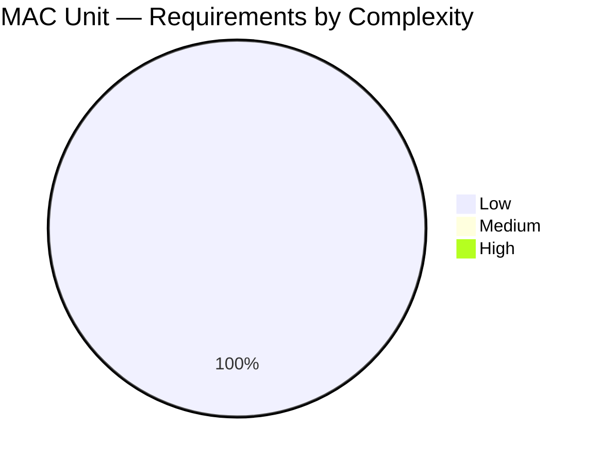

# MAC Unit — Phase 1 Requirements Document

- **Design:** 8-bit pipelined Multiply-Accumulate (MAC) unit
- **Phase:** P1 Research
- **Date:** 2026-04-23
- **Author:** spec-analyst
- **Source:** User design brief (2026-04-23)

---

## 1. Design Overview

The MAC unit computes the running sum:

```
acc_{n+1} = acc_{n} + (A_n * B_n)
```

where `A_n` and `B_n` are 8-bit unsigned integers supplied on cycle `n`, and
`acc` is a register holding the accumulated sum. The design is pipelined to
meet target frequency without sacrificing throughput.

Mathematically:
- Partial product width: 8 + 8 = **16 bits** (unsigned)
- Max single product: 255 * 255 = **65,025** (0xFE01)

## 2. Functional Requirements

### REQ-F-001 — Unsigned 8x8 Multiply
The MAC shall compute the unsigned integer product of two 8-bit inputs
`i_a[7:0]` and `i_b[7:0]`, producing a 16-bit partial product internally.

- **Priority:** must
- **Complexity:** low
- **Source:** User brief — "Two 8-bit unsigned integer inputs"
- **Acceptance Criteria:**
  - For every legal input pair `(a, b)` with `a,b in [0, 255]`, the internal
    product equals `a * b` (unsigned, exact) as bit-vector `p[15:0]`.
  - No signed interpretation of either operand is permitted.

### REQ-F-002 — Running Accumulation
The MAC shall maintain a persistent 32-bit unsigned accumulator register
that is updated each cycle a valid product is latched.

- **Priority:** must
- **Complexity:** low
- **Source:** User brief — "Accumulate result output"
- **Acceptance Criteria:**
  - `acc_reg` retains its value between updates (i.e., it is a register, not
    combinational).
  - On each accepted input beat, `acc_reg <= acc_reg + product` (mod 2^32 —
    see REQ-F-006 overflow behavior).

### REQ-F-003 — Pipelined Operation (>= 2 stages)
The datapath shall contain at least two register-separated pipeline stages
between the primary input capture and the accumulator output.

- **Priority:** must
- **Complexity:** low
- **Source:** User brief — "Pipelined operation (at least 2 pipeline stages)"
- **Acceptance Criteria:**
  - Stage 1 (MUL): `i_a`, `i_b`, `i_valid` are captured into stage-1
    registers together with the combinational product `p = i_a * i_b`.
  - Stage 2 (ACC): the stage-1 product is added to the accumulator and the
    result is captured into the output/accumulator register.
  - End-to-end input-to-output latency = 2 clock cycles (see REQ-P-002).

### REQ-F-004 — Synchronous Clear
A synchronous clear signal `i_clr` shall reset the accumulator to zero on
the next rising edge of `clk`, irrespective of `i_valid`.

- **Priority:** must
- **Complexity:** low
- **Source:** User brief — "synchronous i_clr to reset accumulator to 0"
- **Acceptance Criteria:**
  - When `i_clr == 1` on a rising edge of `clk`, `o_acc` becomes `32'h0` two
    cycles later (matching pipeline latency) OR `acc_reg` becomes `32'h0` on
    the next cycle (see REQ-F-004a clarifying clear semantics).
  - `i_clr` takes priority over `i_valid` when both are asserted.

### REQ-F-004a — Clear Semantics (clear applies at accumulator stage)
Clear shall act on the accumulator register directly (Stage 2), so the
accumulator becomes zero on the clock cycle following `i_clr=1`, regardless
of any in-flight product in Stage 1.

- **Priority:** must
- **Complexity:** low
- **Source:** Derived from REQ-F-004 and REQ-F-003
- **Acceptance Criteria:**
  - If `i_clr=1` at cycle `T`, then at cycle `T+1` the accumulator register
    holds `32'h0`.
  - Any product computed in Stage 1 at cycle `T` is **discarded** (not added)
    if `i_clr=1` at cycle `T+1` (clear takes priority at the add stage).

### REQ-F-005 — Valid / Enable Handshake
The pipeline shall advance only on cycles where the corresponding valid
signal is high. No back-pressure is required.

- **Priority:** must
- **Complexity:** low
- **Source:** User brief — "i_valid to gate pipeline; o_valid with 2-cycle latency"
- **Acceptance Criteria:**
  - When `i_valid=0`, the Stage-1 register holds its previous product and
    Stage-2 does not add (accumulator unchanged).
  - `o_valid` mirrors `i_valid` delayed by exactly 2 cycles (pipeline depth),
    and is gated low by `i_clr` assertion in the same cycle as the Stage-2
    add that would have produced it.

### REQ-F-006 — Overflow Detection (wrap + sticky flag)
When the 32-bit accumulator addition produces a carry-out, the unit shall
wrap (natural modulo 2^32 behavior) and set a sticky overflow flag
`o_ovf` that remains high until cleared by `i_clr`.

- **Priority:** must
- **Complexity:** low
- **Source:** User brief — "wrap with separate overflow flag"
- **Acceptance Criteria:**
  - For any add `acc_reg + p` whose mathematical result exceeds `2^32 - 1`,
    `acc_reg` receives the low 32 bits of the sum and `o_ovf` is set to 1.
  - `o_ovf` is cleared to 0 synchronously with `i_clr`.
  - Once set, `o_ovf` stays high even if subsequent adds do not overflow
    (sticky semantics).

### REQ-F-007 — Asynchronous-assert, Synchronous-deassert Reset
An active-low reset `rst_n` shall asynchronously force all registers
(accumulator, pipeline, valid, overflow) to their quiescent states and
shall be deasserted synchronously with `clk`.

- **Priority:** must
- **Complexity:** low
- **Source:** Project convention (rtl-coding-conventions.md)
- **Acceptance Criteria:**
  - While `rst_n=0`: `acc_reg=0`, all pipeline valid bits = 0, `o_ovf=0`.
  - `rst_n` deassertion is synchronized to `clk` externally; the MAC relies
    on the incoming `rst_n` already being synchronous on deassert.

### REQ-F-008 — Deterministic, Combinational-free Outputs
All module outputs (`o_acc`, `o_valid`, `o_ovf`) shall be driven directly
by registered signals (no combinational output paths).

- **Priority:** must
- **Complexity:** low
- **Source:** rtl-coding-conventions.md (registered-output policy)
- **Acceptance Criteria:**
  - Post-synthesis netlist shows all three outputs driven from flip-flop Q
    pins without intervening combinational logic.

## 3. Performance Requirements

### REQ-P-001 — Throughput: 1 MAC per clock
The pipeline shall accept one new `(a, b)` pair per clock cycle and produce
one accumulated result per clock cycle (steady state).

- **Priority:** must
- **Complexity:** low
- **Source:** Derived from pipelined operation (REQ-F-003)
- **Acceptance Criteria:**
  - With `i_valid=1` held high continuously, the throughput is 1 beat/cycle.
  - No bubble cycle is required between consecutive valid inputs.

### REQ-P-002 — Input-to-Output Latency: 2 cycles
The latency from `i_valid=1` (with `i_a, i_b`) to the corresponding
`o_valid=1` (with accumulated `o_acc`) shall be exactly 2 cycles.

- **Priority:** must
- **Complexity:** low
- **Source:** User brief — "o_valid with 2-cycle latency"
- **Acceptance Criteria:**
  - If `i_valid=1` and `(i_a, i_b) = (A, B)` at cycle T, then at cycle T+2
    `o_valid=1` and `o_acc = (acc_prior + A*B) mod 2^32`.

### REQ-P-003 — Target Frequency
[AMBIGUITY: REQ-P-003] The target operating frequency is not specified in
the user brief. A conservative default of **500 MHz** is proposed for
downstream phases but must be confirmed.

- **Priority:** should
- **Complexity:** low
- **Source:** Project convention default
- **Acceptance Criteria (provisional):**
  - Post-synthesis worst-case timing slack >= 0 ns at 500 MHz in the target
    process (TBD in P2).

## 4. Interface Requirements

### REQ-F-009 — Port List and Naming
The module shall expose the following ports, using project naming conventions
(inputs `i_*`, outputs `o_*`, clock `clk`, active-low reset `rst_n`).

| Port       | Dir | Width | Description                     |
|------------|-----|-------|---------------------------------|
| `clk`      | in  | 1     | System clock, rising-edge       |
| `rst_n`    | in  | 1     | Active-low async-assert reset   |
| `i_clr`    | in  | 1     | Synchronous accumulator clear   |
| `i_valid`  | in  | 1     | Input beat valid                |
| `i_a`      | in  | 8     | Multiplier operand A (unsigned) |
| `i_b`      | in  | 8     | Multiplier operand B (unsigned) |
| `o_valid`  | out | 1     | Output beat valid (2-cycle lat) |
| `o_acc`    | out | 32    | Accumulated sum (unsigned)      |
| `o_ovf`    | out | 1     | Sticky overflow flag            |

- **Priority:** must
- **Complexity:** low
- **Source:** User brief + io_definition.json (this document)
- **Acceptance Criteria:**
  - All ports match names, directions, and widths in `io_definition.json`.

## 5. Pipeline Depth & Latency Analysis

- **Pipeline depth:** 2 stages
  - Stage 1 (MUL): register the product and operands' valid.
  - Stage 2 (ACC): register `acc_reg + p_stage1` and `o_valid`.
- **Latency (i_valid -> o_valid):** 2 cycles (REQ-P-002).
- **Throughput:** 1 beat/cycle (REQ-P-001).
- **Fill latency:** 2 cycles to first valid output after a clear+first input.
- **Drain latency:** 0 cycles; when `i_valid` goes low, Stage 1 and Stage 2
  simply hold. No additional flush required.

### Rationale for 2 stages vs 3 stages
- An 8x8 unsigned multiplier at 500 MHz in a modern process has ample slack
  when registered as a single stage; splitting it further (3-stage partial
  product tree) provides no frequency benefit at this size but adds area
  and latency (REQ-P-002 would break). The 2-stage choice is minimal and
  sufficient. See `algorithm-survey.md` for a full trade-off study.

## 6. Accumulator Width Analysis (Overflow Avoidance)

- Max single product: 255 x 255 = 65,025 (< 2^16).
- Accumulator width = `16 + ceil(log2(N))` where `N` is the expected worst-case
  number of consecutive max-value accumulations before a clear.

| acc_width | Max accumulations of max-value product before overflow |
|-----------|--------------------------------------------------------|
| 16 bits   | 1 (already overflows on the very first add!)           |
| 24 bits   | 2^24 / 65025 ≈ 258                                     |
| **32 bits** | **2^32 / 65025 ≈ 66,051**                            |
| 48 bits   | ~4.3e9 (overkill for 8-bit operands)                   |

**Decision:** 32-bit accumulator (`o_acc[31:0]`). This comfortably covers
>65,000 max-value accumulations, which is sufficient for typical DSP filter
and convolution use cases between explicit clears. Captured as
**REQ-F-002** (accumulator width) and tracked by **OPEN-1-001** if the user
wants a parameterizable width.

## 7. Reset / Clear Behavior Summary

| Stimulus | Action                                    | Covered by |
|----------|-------------------------------------------|------------|
| `rst_n=0` | All registers -> 0, async-assert          | REQ-F-007 |
| `i_clr=1` | `acc_reg -> 0` next clk, `o_ovf -> 0`    | REQ-F-004, REQ-F-004a, REQ-F-006 |
| `i_valid=0` | Pipeline stalls (hold), acc unchanged   | REQ-F-005 |

Priority (highest to lowest): `rst_n` > `i_clr` > `i_valid`.

## 8. Handshake Summary

- No back-pressure (producer-driven, always-ready sink).
- `i_valid` gates Stage-1 capture.
- `o_valid` is Stage-2 valid; it is asserted exactly 2 cycles after the
  corresponding `i_valid`, and is suppressed on any cycle where `i_clr`
  fires at the accumulator stage.

## 9. Open / Ambiguous Items (deferred to P2)

- [AMBIGUITY: REQ-P-003] Target operating frequency is not specified.
- [AMBIGUITY: OPEN-1-001] Whether accumulator width should be parameterized.
- [AMBIGUITY: OPEN-1-002] Whether saturation mode should be supported in
  addition to wrap (user stated "wrap with overflow flag" but a user-selectable
  mode may be desirable for DSP reuse).
- [AMBIGUITY: OPEN-1-003] Whether operand signedness should be parameterized
  (unsigned-only per user brief, but signed-mode reuse is common).
- [AMBIGUITY: OPEN-1-004] Target process/library for synthesis.

No CONFLICTS detected across the user brief.

## 10. Coverage Matrix

| Source Statement (User Brief)                                   | REQ IDs |
|-----------------------------------------------------------------|---------|
| "Two 8-bit unsigned integer inputs: A[7:0], B[7:0]"             | REQ-F-001, REQ-F-009 |
| "Pipelined operation (at least 2 pipeline stages)"              | REQ-F-003, REQ-P-001, REQ-P-002 |
| "Accumulate result output"                                      | REQ-F-002, REQ-F-009 |
| "Unsigned integer arithmetic"                                   | REQ-F-001, REQ-F-002 |
| "synchronous i_clr to reset accumulator to 0"                   | REQ-F-004, REQ-F-004a |
| "i_valid to gate pipeline; o_valid with 2-cycle latency"        | REQ-F-005, REQ-P-002 |
| "wrap with separate overflow flag"                              | REQ-F-006 |
| "Accumulator output width: ... recommend 32-bit"                | REQ-F-002, REQ-F-009 |
| "Pipeline stages: Stage 1 = multiply, Stage 2 = accumulate"     | REQ-F-003 |
| (Project convention — async reset, registered outputs)          | REQ-F-007, REQ-F-008 |

---

## 11. Self-Validation Report

- Total design statements in user brief: 10
- Total iron requirements produced (REQ-F-* + REQ-P-*): 12 (F-001..F-009 + F-004a, P-001..P-003)
- Coverage: 10/10 user statements mapped (see matrix above)
- Suspect gaps: **None** — every user statement is covered; project-convention
  requirements (reset, registered outputs) are added with clear source.
- **Verdict: COMPLETE**

### Ambiguity Assessment

| Axis                 | Score | Evidence                                                         |
|----------------------|-------|------------------------------------------------------------------|
| Goal Clarity (40%)   | 0.10  | Design goal ("pipelined 8-bit MAC") is unambiguous.              |
| Constraint Clarity (30%) | 0.40 | Target frequency / area / process are unspecified (REQ-P-003). |
| AC Clarity (30%)     | 0.20  | Latencies and widths are explicit; overflow policy is explicit.  |
| **Ambiguity Score**  | **0.22** | weighted_average = 0.4*0.10 + 0.3*0.40 + 0.3*0.20 = 0.22     |
| **Gate Decision**    | **PASS** | Score <= 0.3 — proceed to Phase 2.                           |

## 12. Requirements Complexity Distribution



All requirements are low-complexity: an 8x8 MAC is a textbook DSP primitive
with no novel algorithmic or cross-cutting concerns.
