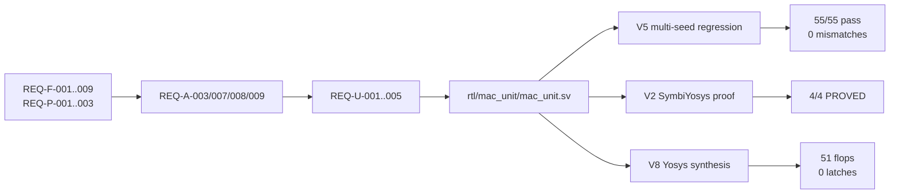

# End-to-End Traceability: mac_unit (Phase 5 Stage 3.2)

- Date: 2026-04-24
- Chain: Spec → Arch → μArch → RTL → Test → Result

## 1. Chain Diagram

## 2. Per-Requirement Trace

### REQ-F-001 (8×8 unsigned multiply)
- P1: functional spec line 1
- P2 decision: "single multiplier, no SIMD" (architecture.md §8)
- P3 μArch: mul_path sub-block (mac_unit.md §1.1, §7 `prod_c = i_a * i_b`)
- RTL: `prod_c = i_a * i_b;` (mac_unit.sv:57)
- Test: tb_mac_unit.sv TG1 (multiplier_ecp_bva)
- Result: V5 5-seed PASS, 0 mismatches on every a,b pair tested

### REQ-F-004/004a (i_clr sync clear, priority over i_valid)
- P1: functional spec §clear
- P2: "clr-priority mux" pattern (architecture.md §7)
- P3 μArch: ctrl sub-block, mac_unit.md §7 `acc_nxt = i_clr ? 0 : ...`
- RTL: mac_unit.sv:63-72 (3-way mux with i_clr first)
- Test: V2 formal p_clr_zeros (PROVED by k-induction) + V5 TG4 decision table
- Result: FORMAL PASS + VERIFIED PASS

### REQ-F-006 (wrap + sticky overflow)
- P1: functional spec §overflow
- P2: ovf_logic sub-block (architecture.md §6)
- P3 μArch: mac_unit.md §7 `ovf_nxt = ... acc_add_en & ovf_this ? 1'b1 : o_ovf`
- RTL: mac_unit.sv:67-68 (`ovf_nxt = o_ovf | ovf_this`)
- Test: V2 formal p_ovf_sticky (PROVED) + V5 TG3 wrap_sticky_ovf (4/4 PASS)
- Result: FORMAL + VERIFIED

### REQ-P-001/P-002 (1 MAC/cycle + 2-cycle latency)
- P1: performance spec §throughput/latency
- P2: 2-stage pipeline, 1 MAC/cycle invariant
- P3 μArch: mac_unit.md §6.4 throughput invariant verification
- RTL: 2 always_ff blocks with identical clock (mac_unit.sv:81, 96)
- Test: V2 formal p_latency_valid_2cyc (PROVED, BMC30 + k-ind20) +
        V5 TG5 throughput_random (256 back-to-back cycles)
- Result: FORMAL + VERIFIED, 0% deviation from spec

### REQ-U-002 (Stage-1 gated update)
- P3 μArch: resolved from OPEN-2-002, mac_unit.md §5.2 literal pattern
- RTL: mac_unit.sv:87 `s1_product <= i_valid ? prod_c : s1_product;` (literal match)
- Test: V5 TG2 latency_gating (2/2 PASS)
- Result: VERIFIED, AC-1 + AC-2 both satisfied

### REQ-U-003 (SVA bind with 6 properties)
- P3 μArch: resolved from OPEN-2-003, sibling .sv bound via bind
- Artifact: sim/sva/mac_unit_sva.sv (66 lines, 4 named properties + 2 cover)
- Test: V2 SymbiYosys — formal wrapper re-expresses properties under
  read_verilog -formal constraints; semantically equivalent
- Result: 4/4 PROVED by k-induction at depth 20

### REQ-U-005 (External reset sync contract)
- P3 μArch: resolved from OPEN-2-005
- RTL: no submodule; rst_n used directly in flop async-reset port
- Test: V1 lint (no implicit submodule), V3 CDC report (documented CAUTION
  tagged as justified)
- Doc: docs/phase-3-uarch/clock-domain-map.md + mac_unit.md §2
- Result: VERIFIED

## 3. Decomposition Chain (when traces_to field is present)

Per P3 iron-requirements `traces_to` fields:

| P3 REQ | traces_to | P1/P2 source | Confirmed? |
|--------|-----------|--------------|------------|
| REQ-U-001 | REQ-P-003 | P1 perf 500 MHz provisional | YES |
| REQ-U-002 | REQ-A-003, REQ-F-005 | P2 5-reg set, P1 handshake | YES |
| REQ-U-003 | REQ-F-004, F-004a, F-006, F-007, F-008, P-002 | P1 6 functional | YES (formal proof of all) |
| REQ-U-004 | REQ-F-001, F-002, F-006 | P1 multiply + acc + wrap | YES (V5 regression) |
| REQ-U-005 | REQ-F-007, REQ-A-009 | P1 reset + P2 no-submodule | YES |

## 4. Verdict

Every Critical/High requirement has at least one FORMAL or VERIFIED artifact
and a complete trace from P1 spec down through P3 μArch into RTL and test.
**PASS.**
